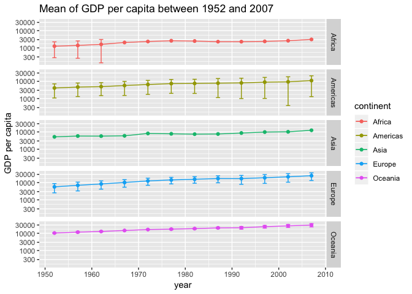
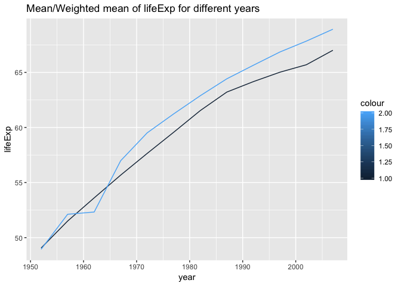
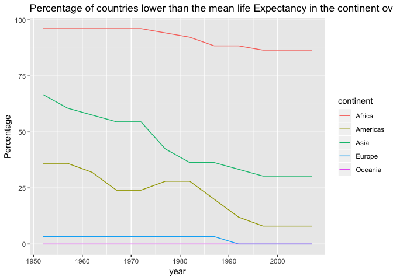
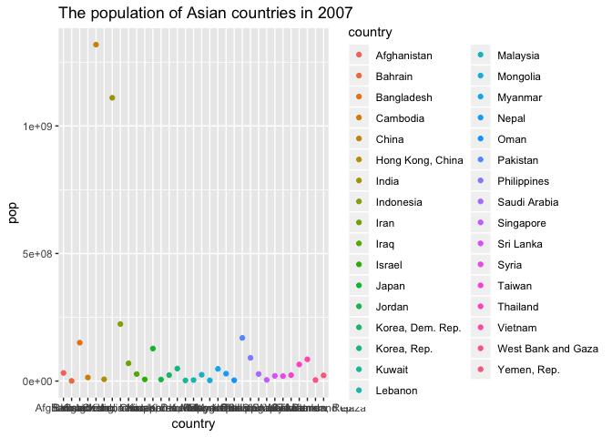

hw03-lh563
================
Lu Han
9/27/2018

### 1. Getting Started:

Install/Load Gapminder and dyplyr

``` r
library(gapminder)
library(tidyverse)
suppressPackageStartupMessages(library(dplyr))
```

### 2. Task menu

Explore the gapminder dataframe

**2a. Get the maximum and minimum of GDP per capita for all continents.**

``` r
b<-gapminder %>% 
  group_by(continent) %>% 
  summarise(max_gdpPercap=max(gdpPercap),
            min_gdpPercap=min(gdpPercap))
  knitr::kable(b)
```

| continent      |   max\_gdpPercap|                             min\_gdpPercap|
|:---------------|----------------:|------------------------------------------:|
| Africa         |         21951.21|                                   241.1659|
| Americas       |         42951.65|                                  1201.6372|
| Asia           |        113523.13|                                   331.0000|
| Europe         |         49357.19|                                   973.5332|
| Oceania        |         34435.37|                                 10039.5956|
| \*\*2b. Look a |  t the spread of|  GDP per capita within the continents.\*\*|

``` r
gapminder %>% 
  group_by(continent,year) %>% 
  summarise(max_gdpPercap=max(gdpPercap),
            min_gdpPercap=min(gdpPercap)) %>% 
  ggplot(aes(x=year))+  #x axis=year
  geom_line(aes(y=max_gdpPercap,color=continent))+ #geom_line plots the line with maximum gdpPercap variable as y axis
  geom_line(aes(y=min_gdpPercap,color=continent))+ #geom_line plots the line with minimum gdpPercap variable as y axis
  facet_grid(continent~.)+ #facet separates the plots by continent
  labs(title="Max and Min of GDP per capita between 1952 and 2007",x="year",y="GDP per capita")
```


Now let's look at the other plots.

``` r
gapminder %>% 
  ggplot(aes( continent, gdpPercap )) +
  scale_y_log10()+
  geom_boxplot( aes( fill = continent ))+
  geom_jitter(width=0.2,alpha=0.2)+
  labs( x = "continent", y = "GDP per capita", 
              title = "Boxplot of GDP per capita for each continent")
```


``` r
gapminder %>% 
  group_by(continent,year) %>% 
  summarise(mean_gdpPercap=mean(gdpPercap),
            sd_gdpPercap=sd(gdpPercap)) %>% 
  ggplot(aes(x=year))+ #x axis=year
  scale_y_log10()+
  geom_point(aes(y=mean_gdpPercap,color=continent))+
  geom_line(aes(y=mean_gdpPercap,color=continent))+ #geom_line plots the line with maximum gdpPercap variable as y axis
  geom_errorbar(aes(ymin=mean_gdpPercap-sd_gdpPercap,ymax=mean_gdpPercap+sd_gdpPercap,width=-.9,color=continent))+
  facet_grid(continent~.)+
  labs(title="Mean of GDP per capita between 1952 and 2007",x="year",y="GDP per capita")
```

    ## Warning in self$trans$transform(x): NaNs produced

    ## Warning: Transformation introduced infinite values in continuous y-axis

    ## Warning: Removed 21 rows containing missing values (geom_errorbar).



Conclusion -The Oceania continent has the highest mean of GDP/captita while the Africa lowest. At the same time, the standard deviation of Americas are high while the Asia continent has the lowest SD.

**2c. Compute a trimmed mean of life expectancy for different years. Or a weighted mean, weighting by population. Just try something other than the plain vanilla mean.**

``` r
gapminder %>% 
  group_by(year) %>% 
  summarise(num=sum(as.numeric(pop)),
            mean=mean(lifeExp),
            weighted_mean=weighted.mean(lifeExp,pop)) %>%  #to calculate the weighted mean based on population
  ggplot(aes(x=year))+
  geom_line(aes(y=mean,color=1))+
  geom_line(aes(y=weighted_mean,color=2))+
  labs(x="year",y="lifeExp",title="Mean/Weighted mean of lifeExp for different years")
```



**2d.How is life expectancy changing over time on different continents? ** **Report the absolute and/or relative abundance of countries with low life expectancy over time by continent: Compute some measure of worldwide life expectancy – you decide – a mean or median or some other quantile or perhaps your current age. Then determine how many countries on each continent have a life expectancy less than this benchmark, for each year.**

First, I calculate the mean lifeExp of that year for all the countries.

``` r
eachyear_lifeExp<-gapminder %>% 
  select(year,lifeExp) %>% 
  group_by(year) %>% 
  summarise(mean_lifeExp=mean(lifeExp))
knitr::kable(eachyear_lifeExp)
```

|     year|                                                                                                                                                                                                       mean\_lifeExp|
|--------:|-------------------------------------------------------------------------------------------------------------------------------------------------------------------------------------------------------------------:|
|     1952|                                                                                                                                                                                                            49.05762|
|     1957|                                                                                                                                                                                                            51.50740|
|     1962|                                                                                                                                                                                                            53.60925|
|     1967|                                                                                                                                                                                                            55.67829|
|     1972|                                                                                                                                                                                                            57.64739|
|     1977|                                                                                                                                                                                                            59.57016|
|     1982|                                                                                                                                                                                                            61.53320|
|     1987|                                                                                                                                                                                                            63.21261|
|     1992|                                                                                                                                                                                                            64.16034|
|     1997|                                                                                                                                                                                                            65.01468|
|     2002|                                                                                                                                                                                                            65.69492|
|     2007|                                                                                                                                                                                                            67.00742|
|  Next, I|  want to calculate whether the lifeExp for each country is less than the mean for continent each year.By the previous knowledge, the dataframe has 1704 rows, so we have to repeat the mean\_LifeExp for 142 times.|

``` r
a<-gapminder %>% 
  mutate(mean_lifeExp=rep(eachyear_lifeExp$mean_lifeExp,142)) %>% 
  mutate(low=(lifeExp < mean_lifeExp)) %>% 
  select(continent,country,year, lifeExp,mean_lifeExp,low)

Percentage_lifeExp<-a %>% 
  group_by(continent,year) %>% 
  summarise(n_percentlow=sum(low),
            n_countries=n(),
            percentage_low=100*n_percentlow/n_countries)
knitr::kable(Percentage_lifeExp)
```

| continent |  year|  n\_percentlow|  n\_countries|  percentage\_low|
|:----------|-----:|--------------:|-------------:|----------------:|
| Africa    |  1952|             50|            52|        96.153846|
| Africa    |  1957|             50|            52|        96.153846|
| Africa    |  1962|             50|            52|        96.153846|
| Africa    |  1967|             50|            52|        96.153846|
| Africa    |  1972|             50|            52|        96.153846|
| Africa    |  1977|             49|            52|        94.230769|
| Africa    |  1982|             48|            52|        92.307692|
| Africa    |  1987|             46|            52|        88.461539|
| Africa    |  1992|             46|            52|        88.461539|
| Africa    |  1997|             45|            52|        86.538461|
| Africa    |  2002|             45|            52|        86.538461|
| Africa    |  2007|             45|            52|        86.538461|
| Americas  |  1952|              9|            25|        36.000000|
| Americas  |  1957|              9|            25|        36.000000|
| Americas  |  1962|              8|            25|        32.000000|
| Americas  |  1967|              6|            25|        24.000000|
| Americas  |  1972|              6|            25|        24.000000|
| Americas  |  1977|              7|            25|        28.000000|
| Americas  |  1982|              7|            25|        28.000000|
| Americas  |  1987|              5|            25|        20.000000|
| Americas  |  1992|              3|            25|        12.000000|
| Americas  |  1997|              2|            25|         8.000000|
| Americas  |  2002|              2|            25|         8.000000|
| Americas  |  2007|              2|            25|         8.000000|
| Asia      |  1952|             22|            33|        66.666667|
| Asia      |  1957|             20|            33|        60.606061|
| Asia      |  1962|             19|            33|        57.575758|
| Asia      |  1967|             18|            33|        54.545454|
| Asia      |  1972|             18|            33|        54.545454|
| Asia      |  1977|             14|            33|        42.424242|
| Asia      |  1982|             12|            33|        36.363636|
| Asia      |  1987|             12|            33|        36.363636|
| Asia      |  1992|             11|            33|        33.333333|
| Asia      |  1997|             10|            33|        30.303030|
| Asia      |  2002|             10|            33|        30.303030|
| Asia      |  2007|             10|            33|        30.303030|
| Europe    |  1952|              1|            30|         3.333333|
| Europe    |  1957|              1|            30|         3.333333|
| Europe    |  1962|              1|            30|         3.333333|
| Europe    |  1967|              1|            30|         3.333333|
| Europe    |  1972|              1|            30|         3.333333|
| Europe    |  1977|              1|            30|         3.333333|
| Europe    |  1982|              1|            30|         3.333333|
| Europe    |  1987|              1|            30|         3.333333|
| Europe    |  1992|              0|            30|         0.000000|
| Europe    |  1997|              0|            30|         0.000000|
| Europe    |  2002|              0|            30|         0.000000|
| Europe    |  2007|              0|            30|         0.000000|
| Oceania   |  1952|              0|             2|         0.000000|
| Oceania   |  1957|              0|             2|         0.000000|
| Oceania   |  1962|              0|             2|         0.000000|
| Oceania   |  1967|              0|             2|         0.000000|
| Oceania   |  1972|              0|             2|         0.000000|
| Oceania   |  1977|              0|             2|         0.000000|
| Oceania   |  1982|              0|             2|         0.000000|
| Oceania   |  1987|              0|             2|         0.000000|
| Oceania   |  1992|              0|             2|         0.000000|
| Oceania   |  1997|              0|             2|         0.000000|
| Oceania   |  2002|              0|             2|         0.000000|
| Oceania   |  2007|              0|             2|         0.000000|

``` r
Percentage_lifeExp %>% 
  ggplot(aes(year,percentage_low,color=continent))+
  geom_line()+
  labs(x="year",y="Percentage",title="Percentage of countries lower than the mean life Expectancy in the continent over the years")
```



``` r
knitr::kable(Percentage_lifeExp)
```

| continent |  year|  n\_percentlow|  n\_countries|  percentage\_low|
|:----------|-----:|--------------:|-------------:|----------------:|
| Africa    |  1952|             50|            52|        96.153846|
| Africa    |  1957|             50|            52|        96.153846|
| Africa    |  1962|             50|            52|        96.153846|
| Africa    |  1967|             50|            52|        96.153846|
| Africa    |  1972|             50|            52|        96.153846|
| Africa    |  1977|             49|            52|        94.230769|
| Africa    |  1982|             48|            52|        92.307692|
| Africa    |  1987|             46|            52|        88.461539|
| Africa    |  1992|             46|            52|        88.461539|
| Africa    |  1997|             45|            52|        86.538461|
| Africa    |  2002|             45|            52|        86.538461|
| Africa    |  2007|             45|            52|        86.538461|
| Americas  |  1952|              9|            25|        36.000000|
| Americas  |  1957|              9|            25|        36.000000|
| Americas  |  1962|              8|            25|        32.000000|
| Americas  |  1967|              6|            25|        24.000000|
| Americas  |  1972|              6|            25|        24.000000|
| Americas  |  1977|              7|            25|        28.000000|
| Americas  |  1982|              7|            25|        28.000000|
| Americas  |  1987|              5|            25|        20.000000|
| Americas  |  1992|              3|            25|        12.000000|
| Americas  |  1997|              2|            25|         8.000000|
| Americas  |  2002|              2|            25|         8.000000|
| Americas  |  2007|              2|            25|         8.000000|
| Asia      |  1952|             22|            33|        66.666667|
| Asia      |  1957|             20|            33|        60.606061|
| Asia      |  1962|             19|            33|        57.575758|
| Asia      |  1967|             18|            33|        54.545454|
| Asia      |  1972|             18|            33|        54.545454|
| Asia      |  1977|             14|            33|        42.424242|
| Asia      |  1982|             12|            33|        36.363636|
| Asia      |  1987|             12|            33|        36.363636|
| Asia      |  1992|             11|            33|        33.333333|
| Asia      |  1997|             10|            33|        30.303030|
| Asia      |  2002|             10|            33|        30.303030|
| Asia      |  2007|             10|            33|        30.303030|
| Europe    |  1952|              1|            30|         3.333333|
| Europe    |  1957|              1|            30|         3.333333|
| Europe    |  1962|              1|            30|         3.333333|
| Europe    |  1967|              1|            30|         3.333333|
| Europe    |  1972|              1|            30|         3.333333|
| Europe    |  1977|              1|            30|         3.333333|
| Europe    |  1982|              1|            30|         3.333333|
| Europe    |  1987|              1|            30|         3.333333|
| Europe    |  1992|              0|            30|         0.000000|
| Europe    |  1997|              0|            30|         0.000000|
| Europe    |  2002|              0|            30|         0.000000|
| Europe    |  2007|              0|            30|         0.000000|
| Oceania   |  1952|              0|             2|         0.000000|
| Oceania   |  1957|              0|             2|         0.000000|
| Oceania   |  1962|              0|             2|         0.000000|
| Oceania   |  1967|              0|             2|         0.000000|
| Oceania   |  1972|              0|             2|         0.000000|
| Oceania   |  1977|              0|             2|         0.000000|
| Oceania   |  1982|              0|             2|         0.000000|
| Oceania   |  1987|              0|             2|         0.000000|
| Oceania   |  1992|              0|             2|         0.000000|
| Oceania   |  1997|              0|             2|         0.000000|
| Oceania   |  2002|              0|             2|         0.000000|
| Oceania   |  2007|              0|             2|         0.000000|

\*\* 2e.Find countries with interesting stories. Open-ended and, therefore, hard. Promising but unsuccessful attempts are encouraged. This will generate interesting questions to follow up on in class.\*\*

``` r
Asiancountry2007 <-subset(gapminder,(year==2007)&(continent=="Asia"),select=c(country,pop))
                         
Asiancountry2007plot<-ggplot(Asiancountry2007,aes(country,pop,color=country))+
  geom_point()+
  labs(x="country",y="pop",title="The population of Asian countries in 2007")
Asiancountry2007plot
```



``` r
# The plot tells us China and India have the most population in Asia. 
```
