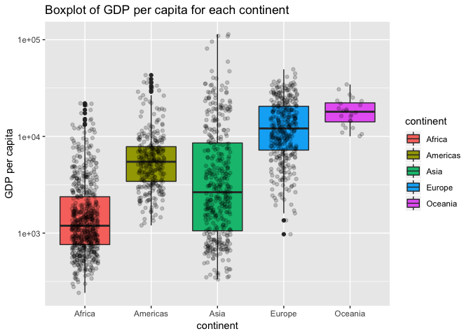

hw03-lh563
================
Lu Han
9/27/2018

### 1. Getting Started:

Install/Load Gapminder and dyplyr

``` r
library(gapminder)
library(tidyverse)
suppressPackageStartupMessages(library(dplyr))
```

### 2. Task menu

Explore the gapminder dataframe

**2a. Get the maximum and minimum of GDP per capita for all continents.**

``` r
maxmin_gdpPercap<-gapminder %>% 
  group_by(continent) %>% 
  summarise(max_gdpPercap=max(gdpPercap),
            min_gdpPercap=min(gdpPercap)) %>% 
  knitr::kable()
```

**2b. Look at the spread of GDP per capita within the continents.**

``` r
gapminder %>% 
  group_by(year) %>% 
  ggplot(aes(x=year)) + #x axis=year
  geom_line(aes(y=max(gdpPercap),color=continent))+ #geom_line plots the line with maximum gdpPercap variable as y axis
  geom_line(aes(y=min(gdpPercap),color=continent))+ #geom_line plots the line with minimum gdpPercap variable as y axis
  facet_grid(continent~.)+ #facet separates the plots by continent
  labs(title="Max and Min of GDP per capita between 1952 and 2007",x="year",y="GDP per capita")
```


Now let's look at the other plots.

``` r
gapminder %>% 
  ggplot(aes( continent, gdpPercap )) +
  scale_y_log10()+
  geom_boxplot( aes( fill = continent ))+
  geom_jitter(width=0.2,alpha=0.2)
```



``` r
  labs( x = "continent", y = "GDP per capita", 
              title = "Boxplot of GDP per capita for each continent")
```

    ## $x
    ## [1] "continent"
    ## 
    ## $y
    ## [1] "GDP per capita"
    ## 
    ## $title
    ## [1] "Boxplot of GDP per capita for each continent"
    ## 
    ## attr(,"class")
    ## [1] "labels"

Compute a trimmed mean of life expectancy for different years. Or a weighted mean, weighting by population. Just try something other than the plain vanilla mean.

How is life expectancy changing over time on different continents?

Report the absolute and/or relative abundance of countries with low life expectancy over time by continent: Compute some measure of worldwide life expectancy – you decide – a mean or median or some other quantile or perhaps your current age. Then determine how many countries on each continent have a life expectancy less than this benchmark, for each year.

Find countries with interesting stories. Open-ended and, therefore, hard. Promising but unsuccessful attempts are encouraged. This will generate interesting questions to follow up on in class.
